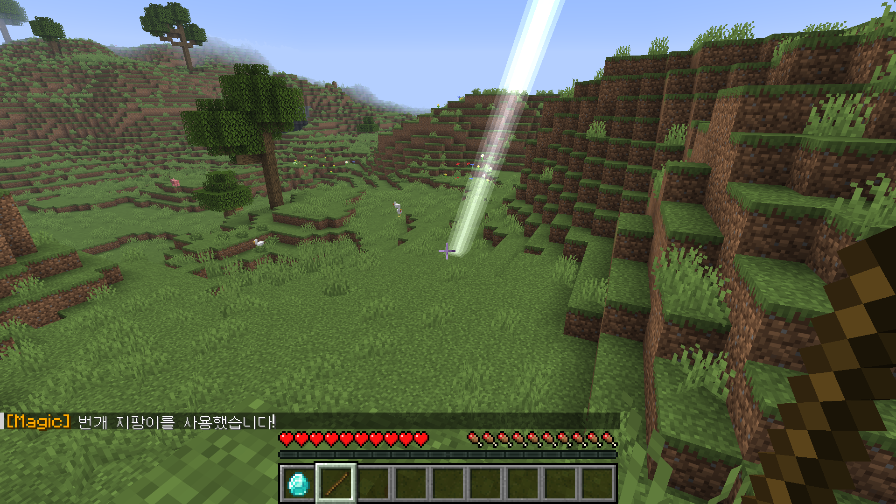

# 🎮 MyFirstMCPlugin - 마인크래프트 첫 플러그인 프로젝트

마인크래프트 서버 환경에서 동작하는 플러그인 개발의 기초 역량을 증명하기 위한 프로젝트입니다.
단순한 코드 작성을 넘어, 실제 서버 환경에서의 빌드 및 배포 전 과정을 완수했습니다.

---

## 🛠️ 개발 환경 및 기술 스택

- **Language:** Java 21 (LTS)
- **Build Tool:** Maven
- **API:** PaperMC API (최신 버전 호환)
- **IDE:** Visual Studio Code

---

## ✅ 주요 성과 및 확인 과정

### 1. Maven 빌드 성공 (Build Automation)

Java 21 환경에서 Maven을 사용하여 소스 코드를 실행 가능한 `.jar` 파일로 변환하는 빌드 프로세스를 수립했습니다. 터미널을 통해 프로젝트의 무결성을 검증하고 빌드 성공을 확인했습니다.

> **[빌드 결과 인증]**
> 

### 2. 서버 내 플러그인 활성화 확인 (Plugin Load)

PaperMC 서버의 `plugins` 폴더에 배포 후, 서버 콘솔에서 `/pl` 명령어를 입력하여 플러그인이 정상적으로 로드(초록색 활성화)된 것을 최종 확인했습니다.

> **[플러그인 활성화 인증]**
> 

---

## 💡 해결했던 문제 (Troubleshooting)

- **파일 시스템 잠금 이슈 해결:** 서버 구동 중 파일 덮어쓰기 제한 문제를 서버 프로세스 제어(`stop` 커맨드)를 통해 해결하며 배포 안정성을 확보했습니다.

---

### 3. 인게임 이벤트 리스너 구현 (Event Listener)

- `AsyncPlayerChatEvent`를 활용하여 플레이어의 채팅을 감지하고 반응하는 시스템을 구현했습니다.
- 특정 키워드("안녕") 입력 시 서버가 즉각적으로 시스템 메시지를 반환하도록 설정하여, 서버와 클라이언트 간의 상호작용 로직을 완성했습니다.

> **[인게임 작동 검증 (In-game Verification)]**
> 

---

### 4. 게임 내 아이템 지급 시스템 (Scheduler & Inventory API)

- 특정 키워드("다이아몬드") 감지 시 플레이어에게 아이템을 실시간 지급하는 기능을 구현했습니다.
- **Bukkit Scheduler**를 사용하여 비동기 채팅 이벤트 내에서 안전하게 메인 스레드의 인벤토리 API를 호출하는 기술적 이슈를 해결했습니다.
- 이를 통해 서버 안정성을 유지하면서 동적인 게임 콘텐츠 상호작용이 가능함을 검증했습니다.

> **[다이아몬드 지급 검증]**
> 

---

### 5. 특수 능력 아이템 구현 (PlayerInteractEvent)

- `PlayerInteractEvent`를 활용하여 플레이어의 아이템 상호작용(우클릭)을 실시간으로 감지하는 로직을 개발했습니다.
- 특정 아이템(막대기)을 들고 상호작용 시, 플레이어의 시야에 닿는 타겟 블록(`getTargetBlockExact`)을 계산하여 해당 위치에 번개(`strikeLightning`)를 소환하는 동적인 월드 이벤트를 구현했습니다.
- 이를 통해 단순한 텍스트 기반 상호작용을 넘어, 게임 내 물리적 환경 변화와 시각적/청각적 효과를 제어하는 방법을 숙달했습니다.

> **[번개 지팡이 작동 검증]**
> 

---

### 6. 서버 입장 커스텀 타이틀 구현 (PlayerJoinEvent)

- 새로운 이벤트 핸들러 클래스 `JoinListener`를 설계하여 관심사 분리(Separation of Concerns)를 실천했습니다.
- 플레이어가 서버에 접속하는 순간(`PlayerJoinEvent`)을 감지하여 화면 중앙에 거대한 Welcome 타이틀과 서브타이틀(`sendTitle`)이 출력되도록 구현했습니다.
- **Tick 단위 제어:** 타이틀이 나타나는 시간(Fade-in), 머무는 시간(Stay), 사라지는 시간(Fade-out)을 틱(Tick) 단위로 정교하게 조정하여 사용자 경험(UX)을 향상시켰습니다.

> **[입장 환영 타이틀 검증]**
> 

---

### 7. 투척형 시한폭탄 기믹 구현 (Physics & Scheduler)

- 마인크래프트의 물리 엔진과 스케줄러를 결합하여 실전 방송 콘텐츠에서 활용 가능한 '투척형 수류탄' 시스템을 개발했습니다.
- **물리 로직 적용:** 플레이어가 TNT 아이템을 우클릭 시, 시선 방향(`getDirection`)에 맞춰 가속도(`setVelocity`)를 계산하여 아이템을 실제로 던지는 물리 효과를 구현했습니다.
- **비동기 타이머 제어:** `BukkitRunnable`을 활용해 3초간의 카운트다운 로직을 설계했습니다. 매초마다 긴장감을 유발하는 '틱' 소리(Sound)를 재생하고, 종료 시점에 정확히 아이템의 위치에서 폭발 효과가 발생하도록 제어했습니다.
- **방송 연출 최적화:** 상황극의 몰입도를 위해 폭발 효과는 유지하되, 지형 파괴 여부를 옵션으로 조절할 수 있도록 설계하여 맵 관리의 편의성을 높였습니다.

> **[투척형 시한폭탄 작동 검증]**
> 

--

### 8. 커스텀 GUI 기반 직업 선택 시스템 (InventoryClickEvent)

- 플레이어의 편의성과 시각적 연출을 위해 명령어(`/메뉴`) 입력 시 가상의 인벤토리(Custom GUI)가 열리도록 구현했습니다.
- `ItemMeta`를 활용해 아이템의 이름과 설명(Lore)을 커스텀하여 직관적인 UI를 구성했습니다.
- `InventoryClickEvent`를 제어하여 플레이어가 메뉴 안의 아이템을 가져가는 어뷰징을 방지(`setCancelled(true)`)하고, 클릭한 아이템의 종류에 따라 각기 다른 장비와 효과음이 지급되도록 분기 처리했습니다.
- 이를 통해 복잡한 상황극이나 미니게임에서 참가자들의 역할 및 아이템 세팅을 자동화할 수 있는 시스템 기획력을 입증했습니다.

> **[커스텀 GUI 메뉴 작동 검증]**
>
> **1. `/메뉴` 명령어 입력 시 GUI 오픈**
> 
>
> **2. 원하는 직업 아이템 클릭**
> 
>
> **3. 직업에 맞는 무기 및 알림 메시지 지급 완료**
> 

---

### 9. 보스바(BossBar)를 활용한 파밍 타이머 연출 (Scheduler & BossBar API)

- 마인크래프트의 `BossBar API`와 비동기 스케줄러(`BukkitRunnable`)를 활용하여 화면 상단에 남은 시간을 직관적으로 보여주는 실시간 타이머 시스템을 구현했습니다.
- **동적 UI 변화 연출:** 10초부터 시작하여 1초 단위로 게이지바 비율(`setProgress`)이 줄어들며, 남은 시간이 5초 이하가 되면 바의 색상을 초록색에서 빨간색으로 변경하고 경고 텍스트를 출력해 긴장감을 극대화했습니다.
- **서버 전역 동기화:** 타이머 실행 시 서버에 있는 모든 플레이어 화면에 UI가 동기화되도록 설계하여, 대규모 상황극 및 미니게임(예: 추격전 파밍 시간 제한, 생존 카운트다운)에 즉시 투입 가능한 실무형 연출을 완성했습니다.

> **[파밍 타이머 보스바 작동 검증]**
> 

---

### 10. 스토리 기반 NPC 상호작용 및 조건부 퀘스트 시스템
- `PlayerInteractEntityEvent`를 활용하여 맵에 고정된 특정 NPC(주민)와 플레이어 간의 커스텀 상호작용 로직을 구현했습니다.
- **기본 UI 제어 및 스토리 연출:** 우클릭 시 발생하는 주민의 기본 거래 창을 차단(`setCancelled(true)`)하고, 대신 기획된 스토리 대사와 효과음이 출력되도록 설정하여 상황극의 몰입도를 높였습니다.
- **조건부 아이템 교환(퀘스트) 로직:** 플레이어가 손에 들고 있는 아이템(`getItemInMainHand`)을 검사하여, 특정 아이템(케이크)을 건네주었을 때만 인벤토리에서 아이템을 차감하고 보상(다이아몬드)을 지급하는 실무형 퀘스트 시스템을 구축했습니다.
- 이를 통해 대규모 RPG나 스토리 중심 상황극에서 필수적인 NPC 탐문, 단서 획득, 퍼즐 해결 등의 복합적인 기믹을 코드로 완벽하게 구현할 수 있는 역량을 증명합니다.

> **[스토리 NPC 퀘스트 작동 검증]**
> 

---

### 11. HashMap 쿨타임 시스템 및 히트스캔(Hitscan) 마법 무기 구현
- 자바의 핵심 자료구조인 `HashMap<UUID, Long>`을 활용하여 플레이어별 아이템 사용 대기시간(쿨타임)을 독립적으로 계산하고 제어합니다.
- **UI/UX 최적화:** 잦은 채팅 메시지 대신, Spigot API의 `setCooldown`을 활용해 인벤토리 아이템 자체에 직관적인 회색 쿨타임 오버레이 모션을 적용했습니다.
- **히트스캔 충돌 판정:** `Vector`와 `Location`을 이용해 파티클을 일직선으로 발사하며, `getNearbyEntities`를 통해 파티클 반경 내의 생명체(`LivingEntity`)를 실시간으로 탐지합니다.
- 적중 시 타격음과 함께 5.0의 데미지를 가하고 `setFireTicks`로 3초간 화상 상태를 부여하는 복합적인 RPG 무기 로직을 완성했습니다.

> **[마법 지팡이 히트스캔 타격 및 쿨타임 검증]**
> 

---

### 12. 스토리 하이라이트 연출 (컷신 및 화면 고정 시스템)
- 대규모 스토리 콘텐츠에서 시청자의 몰입도를 극대화하기 위한 **'하이라이트 컷신 연출'** 로직을 구현했습니다.
- `HashSet<UUID>`을 활용해 상태 제어 대상자를 관리하고, `PlayerMoveEvent`에서 시선(Yaw/Pitch) 및 이동(X/Y/Z) 변화를 감지하여 완벽하게 행동을 통제(`setCancelled`)합니다.
- `sendTitle`과 `playSound` API를 조합해 시청각적인 긴장감을 조성했으며, 잦은 텍스트 출력을 배제하고 사운드 피드백만으로 UX를 깔끔하게 최적화했습니다.
- `BukkitRunnable` 스케줄러를 사용하여 정확히 3초(60 ticks) 뒤에 화면 고정이 해제되도록 비동기 타이머 로직을 안전하게 처리했습니다.

> **[컷신 및 화면 고정 연출 검증]**
> 

_Last Updated: 2026-05-08_
