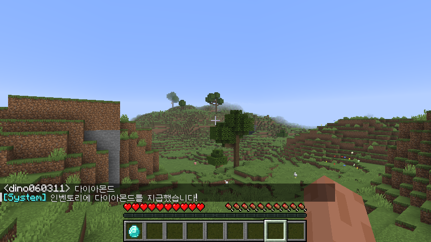

# 🎮 MyFirstMCPlugin - 마인크래프트 첫 플러그인 프로젝트

마인크래프트 서버 환경에서 동작하는 플러그인 개발의 기초 역량을 증명하기 위한 프로젝트입니다.
단순한 코드 작성을 넘어, 실제 서버 환경에서의 빌드 및 배포 전 과정을 완수했습니다.

---

## 🛠️ 개발 환경 및 기술 스택

- **Language:** Java 21 (LTS)
- **Build Tool:** Maven
- **API:** PaperMC API (최신 버전 호환)
- **IDE:** Visual Studio Code

---

## ✅ 주요 성과 및 확인 과정

### 1. Maven 빌드 성공 (Build Automation)

Java 21 환경에서 Maven을 사용하여 소스 코드를 실행 가능한 `.jar` 파일로 변환하는 빌드 프로세스를 수립했습니다. 터미널을 통해 프로젝트의 무결성을 검증하고 빌드 성공을 확인했습니다.

> **[빌드 결과 인증]**
> 

### 2. 서버 내 플러그인 활성화 확인 (Plugin Load)

PaperMC 서버의 `plugins` 폴더에 배포 후, 서버 콘솔에서 `/pl` 명령어를 입력하여 플러그인이 정상적으로 로드(초록색 활성화)된 것을 최종 확인했습니다.

> **[플러그인 활성화 인증]**
> 

---

## 💡 해결했던 문제 (Troubleshooting)

- **파일 시스템 잠금 이슈 해결:** 서버 구동 중 파일 덮어쓰기 제한 문제를 서버 프로세스 제어(`stop` 커맨드)를 통해 해결하며 배포 안정성을 확보했습니다.

---

### 3. 인게임 이벤트 리스너 구현 (Event Listener)

- `AsyncPlayerChatEvent`를 활용하여 플레이어의 채팅을 감지하고 반응하는 시스템을 구현했습니다.
- 특정 키워드("안녕") 입력 시 서버가 즉각적으로 시스템 메시지를 반환하도록 설정하여, 서버와 클라이언트 간의 상호작용 로직을 완성했습니다.

> **[인게임 작동 검증 (In-game Verification)]**
> 

---

### 4. 게임 내 아이템 지급 시스템 (Scheduler & Inventory API)

- 특정 키워드("다이아몬드") 감지 시 플레이어에게 아이템을 실시간 지급하는 기능을 구현했습니다.
- **Bukkit Scheduler**를 사용하여 비동기 채팅 이벤트 내에서 안전하게 메인 스레드의 인벤토리 API를 호출하는 기술적 이슈를 해결했습니다.
- 이를 통해 서버 안정성을 유지하면서 동적인 게임 콘텐츠 상호작용이 가능함을 검증했습니다.

> **[다이아몬드 지급 검증]**
> 

---

### 5. 특수 능력 아이템 구현 (PlayerInteractEvent)
- `PlayerInteractEvent`를 활용하여 플레이어의 아이템 상호작용(우클릭)을 실시간으로 감지하는 로직을 개발했습니다.
- 특정 아이템(막대기)을 들고 상호작용 시, 플레이어의 시야에 닿는 타겟 블록(`getTargetBlockExact`)을 계산하여 해당 위치에 번개(`strikeLightning`)를 소환하는 동적인 월드 이벤트를 구현했습니다.
- 이를 통해 단순한 텍스트 기반 상호작용을 넘어, 게임 내 물리적 환경 변화와 시각적/청각적 효과를 제어하는 방법을 숙달했습니다.

> **[번개 지팡이 작동 검증]**
> 

_Last Updated: 2026-04-28_
