# 🎮 MyFirstMCPlugin - Minecraft 커스텀 게임 시스템 플러그인

Minecraft Paper 서버 환경에서 동작하는 커스텀 게임 시스템 플러그인입니다.

상황극 및 미니게임 서버를 목표로 직업 시스템, 보스 레이드, NPC 상호작용, 컷신 연출, PvP 미니게임, 실시간 UI 시스템 등을 설계하고 구현했습니다.

단순한 기능 구현을 넘어, Maven 기반 빌드 환경 구성부터 실제 서버 적용 및 테스트까지 개발 과정을 직접 수행했습니다.

---

## ✨ 주요 시스템

- 🎭 직업 선택 및 랜덤 직업 시스템
- 🧟 페이즈 기반 보스 레이드 시스템
- 🪄 히트스캔 화염 마법 지팡이
- 💣 투척형 시한폭탄 시스템
- 🧍 NPC 상호작용 및 조건부 퀘스트
- 🎬 컷신 및 화면 고정 연출
- ⚔️ 가위바위보 PvP 데스매치
- 🎣 타임어택 낚시 미니게임
- ⚡ FastBoard 기반 순발력 테스트
- ❤️ 다운(기절) 및 소생 시스템

---

## 🛠️ 개발 환경 및 기술 스택

### 💻 Backend & Core

- **Language:** Java 21 (LTS) _(Maven release target)_
- **Runtime:** Java 25 _(Local Development Environment)_
- **Build Tool:** Maven
- **Server Platform:** PaperMC 1.21.1
- **IDE:** Visual Studio Code

### 📜 Scripting & Extension

- **Engine:** Skript 2.15.2
- **Addons:**
  - **SkBee 3.23.0** — FastBoard, Metadata, NBT 및 고급 Skript 기능 확장
  - **skript-reflect 2.6.3** — Bukkit/Paper API 연동 및 Java 클래스 접근

---

## ⚙️ Java Plugin Systems

### 커스텀 GUI 기반 직업 선택 시스템 (InventoryClickEvent)

- 플레이어의 편의성과 시각적 연출을 위해 명령어(`/직업선택`) 입력 시 가상의 인벤토리(Custom GUI)가 열리도록 구현했습니다.
- `ItemMeta`를 활용해 아이템의 이름과 설명(Lore)을 커스텀하여 직관적인 UI를 구성했습니다.
- `InventoryClickEvent`를 제어하여 플레이어가 메뉴 안의 아이템을 가져가는 어뷰징을 방지(`setCancelled(true)`)하고, 클릭한 아이템의 종류에 따라 각기 다른 장비와 효과음이 지급되도록 분기 처리했습니다.
- 상황극 및 미니게임에서 역할 선택과 초기 장비 세팅을 자동화할 수 있도록 설계했습니다.

> **[커스텀 GUI 메뉴 작동 검증]**
>
> **1. `/직업선택` 명령어 입력 시 GUI 오픈**
> 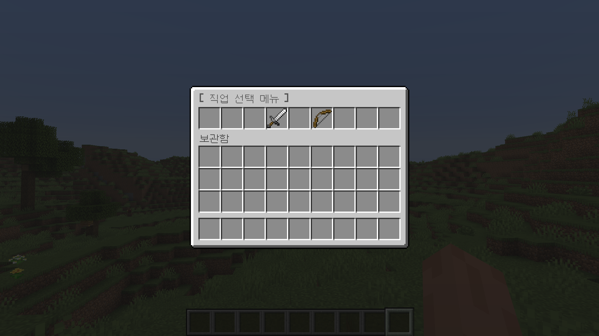
>
> **2. 원하는 직업 아이템 클릭**
> 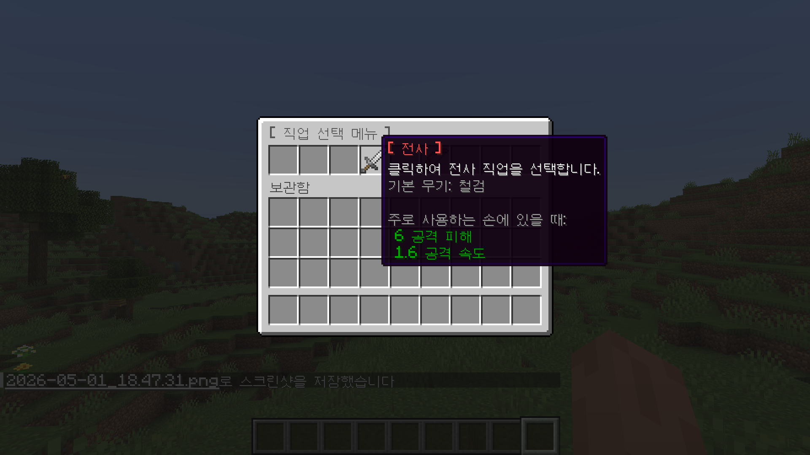
>
> **3. 직업에 맞는 무기 및 알림 메시지 지급 완료**
> 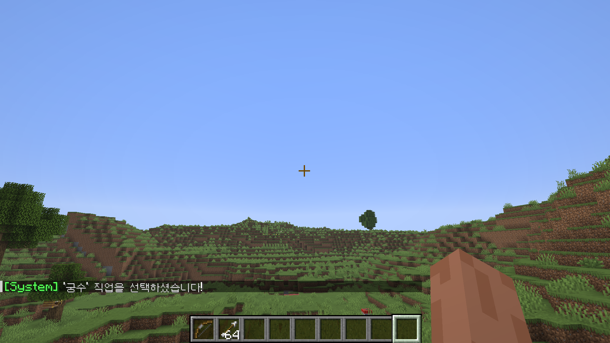

### 보스바(BossBar)를 활용한 파밍 타이머 연출 (Scheduler & BossBar API)

- 마인크래프트의 `BossBar API`와 비동기 스케줄러(`BukkitRunnable`)를 활용하여 화면 상단에 남은 시간을 직관적으로 보여주는 실시간 타이머 시스템을 구현했습니다.
- **동적 UI 변화 연출:** 10초부터 시작하여 1초 단위로 게이지바 비율(`setProgress`)이 줄어들며, 남은 시간이 5초 이하가 되면 바의 색상을 초록색에서 빨간색으로 변경하고 경고 텍스트를 출력해 긴장감을 높였습니다.
- **서버 전역 동기화:** 타이머 실행 시 서버에 있는 모든 플레이어 화면에 UI가 동기화되도록 설계하여, 상황극 및 미니게임 환경에서 활용 가능한 타이머 연출 시스템을 구현했습니다.

> **[파밍 타이머 보스바 작동 검증]**
> 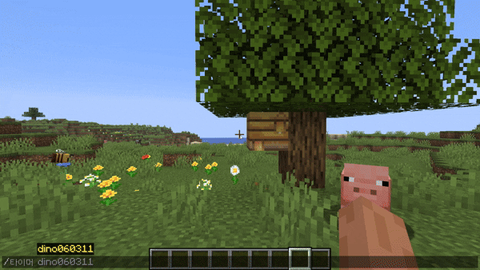

### 페이즈 기반 보스 레이드 시스템

- **역할 기반 클래스 분리:** `BossSpawnCommand`, `BossManager`, `BossListener`, `BossSkillService`로 역할을 분리하여 **보스 생성, 보스바 UI, 페이즈 감지, 스킬 로직**을 각각 독립적으로 관리하도록 설계했습니다.
- **실시간 페이즈 전환 시스템:** 보스 체력 비율(50%, 20%)을 실시간으로 계산하여 **1페이즈 → 2페이즈 → 최종페이즈**가 자연스럽게 전환되도록 구현했습니다. 각 단계마다 보스 이름, 보스바 색상, 스킬이 동적으로 변경됩니다.
- **방송 몰입형 연출 강화:** 페이즈 전환 시 `Adventure Title API`, 사운드, 파티클을 조합하여 **"⚠ PHASE 2", "☠ FINAL PHASE"** 같은 레이드 연출을 구현했습니다. 또한 스킬 발동 전 차징(예고) 시간을 부여해 플레이어가 위험을 인지하고 회피할 수 있는 **보스전 패턴 구조**를 설계했습니다.
- **최종페이즈 증원군 시스템:** 보스 체력이 20% 이하가 되면 주변에 **'보스의 부하' 좀비 5마리**가 소환되도록 구현하여 레이드 후반부 난이도와 긴장감을 높였습니다.
- **Adventure API 기반 메시지 시스템 개선:** 기존 `§` 문자열 색상 코드 대신 `Component.text()` 기반 메시지 시스템을 적용하여 보스 대사 및 경고 메시지를 최신 Paper API 스타일로 통일했습니다.
- **안정성 및 예외 처리:** 보스 중복 소환을 방지하고, 강한 공격으로 체력 구간을 한 번에 넘겨도 페이즈가 정상 전환되도록 상태 검증 로직을 추가했습니다. 또한 스킬 및 메시지가 중복 실행되는 문제를 수정하여 안정성을 높였습니다.

> **[보스 레이드 시스템 작동 검증]**
> 

### 투척형 시한폭탄 기믹 구현 (Physics & Scheduler)

- 마인크래프트의 물리 엔진과 스케줄러를 결합하여 상황극 및 전투 콘텐츠에서 활용 가능한 '투척형 시한폭탄' 시스템을 개발했습니다.
- **아이템 식별 및 예외 처리:** `ItemMeta` 데이터(DisplayName)를 분석하는 로직을 추가하여, 서버 내 일반 TNT 블록 설치와 플러그인 전용 '시한폭탄'의 작동 로직이 충돌하지 않도록 보완했습니다.
- **물리 로직 적용:** 플레이어가 TNT 아이템을 우클릭 시, 시선 방향(`getDirection`)에 맞춰 가속도(`setVelocity`)를 계산하여 아이템을 실제로 던지는 물리 효과를 구현했습니다.
- **비동기 타이머 제어:** `BukkitRunnable`을 활용해 3초간의 카운트다운 로직을 설계했습니다. 매초마다 긴장감을 유발하는 '틱' 소리(Sound)를 재생하고, 종료 시점에 정확히 아이템의 위치에서 폭발 효과가 발생하도록 제어했습니다.
- **방송 연출 최적화:** 상황극의 몰입도를 위해 폭발 효과는 유지하되, 지형 파괴 여부를 옵션으로 조절할 수 있도록 설계하여 맵 관리의 편의성을 높였습니다.

#### 구조 개선 (Refactoring)

- 초기에는 `BombListener` 내부에 이벤트 처리, 물리 계산, 타이머, 폭발 로직이 모두 포함되어 있었으나, 유지보수성을 높이기 위해 실제 폭탄 동작 로직을 `BombService` 클래스로 분리했습니다.
- 이를 통해 **이벤트 감지(Listener)** 와 **게임 로직(Service)** 의 책임을 분리하여 코드 가독성과 유지보수성을 개선했습니다.

> **[투척형 시한폭탄 작동 검증]**
> 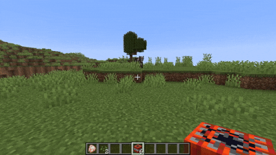

### HashMap 쿨타임 시스템 및 히트스캔(Hitscan) 마법 무기 구현

- 자바의 핵심 자료구조인 `HashMap<UUID, Long>`을 활용하여 플레이어별 아이템 사용 대기시간(쿨타임)을 독립적으로 계산하고 제어합니다.
- **UI/UX 최적화:** 잦은 채팅 메시지 대신, Spigot API의 `setCooldown`을 활용해 인벤토리 아이템 자체에 직관적인 회색 쿨타임 오버레이 모션을 적용했습니다.
- **히트스캔 충돌 판정:** `Vector`와 `Location`을 이용해 파티클을 일직선으로 발사하며, `getNearbyEntities`를 통해 파티클 반경 내의 생명체(`LivingEntity`)를 실시간으로 탐지합니다.
- 적중 시 타격음과 함께 5.0의 데미지를 가하고 `setFireTicks`로 3초간 화상 상태를 부여하는 복합적인 RPG 무기 로직을 완성했습니다.

> **[마법 지팡이 히트스캔 타격 및 쿨타임 검증]**
> 

### 스토리 하이라이트 연출 (컷신 및 화면 고정 시스템)

- 대규모 스토리 콘텐츠에서 시청자의 몰입도를 극대화하기 위한 **'하이라이트 컷신 연출'** 로직을 구현했습니다.
- **바닐라 타겟 셀렉터 통합:** `Bukkit.selectEntities()` API를 활용하여 `@a`, `@p`, `@r` 및 특정 닉네임까지 마인크래프트 표준 대상 지정 방식을 안정적으로 지원합니다. 또한 인자 미입력 시 명령어를 실행한 본인에게 즉시 적용되도록 설계하여 운영 편의성을 높였습니다.
- **유연한 엔티티 필터링:** 셀렉터로 선택된 대상 중 `instanceof Player` 체크를 통해 실제 플레이어에게만 컷신 로직이 실행되도록 안전 장치를 마련했습니다.
- **상태 제어 및 행동 통제:** `HashSet<UUID>`을 활용해 상태 제어 대상자를 관리하고, `PlayerMoveEvent`에서 시선(Yaw/Pitch) 및 이동(X/Y/Z) 변화를 감지하여 컷신 진행 중 행동을 제한(`setCancelled`)하도록 구현했습니다.
- **비동기 연출 최적화:** `sendTitle`과 `playSound`를 조합해 시청각적 긴장감을 조성하고, `BukkitRunnable` 스케줄러를 통해 3초(60틱) 후 자동으로 상태가 해제되는 비동기 타이머 로직을 구현했습니다.

> **[컷신 및 화면 고정 연출 검증]**

https://github.com/user-attachments/assets/ce85301a-fe03-4912-8a56-e9db0e8c9a99

### 스토리 기반 NPC 상호작용 및 조건부 퀘스트 시스템

- `PlayerInteractEntityEvent`를 활용하여 맵에 고정된 특정 NPC(주민)와 플레이어 간의 커스텀 상호작용 로직을 구현했습니다.
- **기본 UI 제어 및 스토리 연출:** 우클릭 시 발생하는 주민의 기본 거래 창을 차단(`setCancelled(true)`)하고, 대신 기획된 스토리 대사와 효과음이 출력되도록 설정하여 상황극의 몰입도를 높였습니다.
- **조건부 아이템 교환(퀘스트) 로직:** 플레이어가 손에 들고 있는 아이템(`getItemInMainHand`)을 검사하여, 특정 아이템(케이크)을 건네주었을 때만 인벤토리에서 아이템을 차감하고 보상(다이아몬드)을 지급하는 조건부 퀘스트 시스템을 구축했습니다.
- 이를 통해 대규모 RPG나 스토리 중심 상황극에서 필수적인 NPC 탐문, 단서 획득, 퍼즐 해결 등의 복합적인 NPC 상호작용 및 퀘스트 기믹을 구현했습니다.

> **[스토리 NPC 퀘스트 작동 검증]**
> 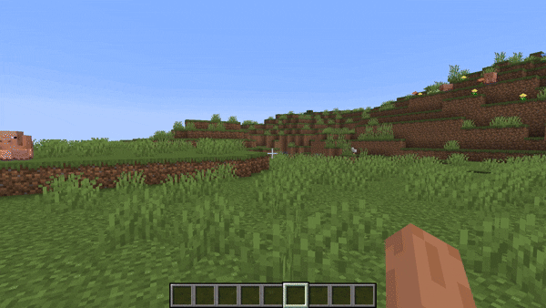

### Merchant API 기반 커스텀 NPC 상점 구현 (무기 대장장이)

- 마인크래프트 기본 주민 거래 시스템을 상황극 경제 시스템에 맞춰 완전히 통제할 수 있는 **커스텀 상점(Merchant GUI)**을 구현했습니다.
- **커스텀 레시피 적용:** `MerchantRecipe` 클래스를 활용해 에메랄드(화폐)와 다이아몬드 장비/활(상품)의 교환 비율을 직접 세팅했습니다. 복잡한 인벤토리 클릭 이벤트를 일일이 막는 대신, 바닐라 친화적인 거래 UI를 제공하여 플레이어의 UX를 향상시켰습니다.
- **엔티티 외형 및 상태 제어:** `Villager.Profession.WEAPONSMITH` 속성을 부여해 시각적인 컨셉을 맞추고, `setAI(false)`와 `setInvulnerable(true)`를 적용하여 상황극 도중 NPC가 이탈하거나 사망하지 않도록 설계했습니다.
- **운영 편의성 커맨드:** 원하는 위치에 즉시 대장장이 NPC를 배치할 수 있는 `/무기대장장이` 커맨드를 구현하여 맵 세팅 및 서버 운영의 편의성을 높였습니다.

> **[무기 대장장이 상점 작동 검증]**
> 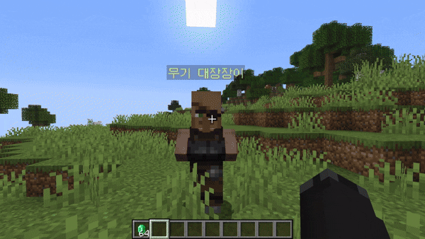

### 애니메이션 기반 직업 추첨 및 자동 배정 시스템 (Roulette & Auto-Assignment)

- 단순히 명령어로 직업을 정하는 방식을 넘어, **GUI 애니메이션**을 활용하여 시청각적 재미를 극대화한 추첨 시스템을 구현했습니다.
- **서비스 계층 분리**: 비즈니스 로직(JobService), 시각적 연출(RouletteService), 데이터 관리(RoleManager)를 각각 독립된 클래스로 설계하여 유지보수성과 코드 재사용성을 높였습니다.
- **애니메이션 연출:** `BukkitRunnable` 스케줄러를 활용해 9칸 가상 인벤토리 중앙에서 아이콘들이 빠르게 회전(룰렛)하다가 서서히 멈추는 연출을 구현했습니다. 각 회전 단계마다 경쾌한 효과음(`Sound.BLOCK_NOTE_BLOCK_BASS`)을 재생해 긴장감을 유발합니다.
- **자동 역할 분배 로직:** `Collections.shuffle`과 `Map<UUID, String>`을 결합하여 관리자가 명령어를 치는 순간 마피아 1명, 경찰 1명, 의사 1명, 나머지 시민으로 비율에 맞게 결과를 선행 확정합니다. 이는 인원이 많아져도 밸런스가 무너지지 않는 안정적인 게임 운영을 보장합니다.
- **직업별 장비 자동화:** 추첨 완료 시 각 직업의 상징 아이템(마피아: 쇠뇌/화살, 경찰: 철검, 의사: 불사의 토템, 시민: 빵)이 자동으로 인벤토리에 지급되도록 설계하여 상황극 준비 시간을 줄일 수 있도록 설계했습니다.
- **보안 로직 적용:** 추첨이 진행되는 동안 플레이어가 룰렛 아이템을 마우스로 클릭하여 탈취하거나 취소할 수 없도록 `InventoryClickEvent`를 차단(`setCancelled`)했습니다.

> **[랜덤직업 작동 검증]**
> 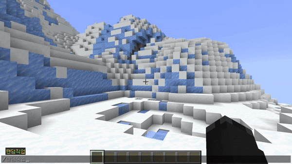

### 사용자 경험(UX) 개선 및 서버 가이드 시스템

- **접속 이벤트 최적화:** `PlayerJoinEvent`를 활용하여 신규/기존 플레이어 접속 시 `sendTitle`을 통한 환영 연출과 채팅 가이드를 자동 출력하여 서버의 첫인상을 강화했습니다.
- **통합 서버 가이드 제공:** 기존 Java 플러그인 기반 도움말 시스템을 Skript 기반 `/서버명령어`로 개선하여 서버 내 주요 기능(마법 지팡이, 시한폭탄, 직업 선택, 미니게임 등)을 한눈에 확인할 수 있도록 설계했습니다.
- **콘텐츠 접근성 향상:** `/미니게임` GUI 허브를 추가하여 플레이어가 미니게임 콘텐츠를 직관적으로 탐색하고 즉시 실행할 수 있도록 UX를 개선했습니다.

> **[서버 가이드 및 미니게임 허브 작동 검증]**
> 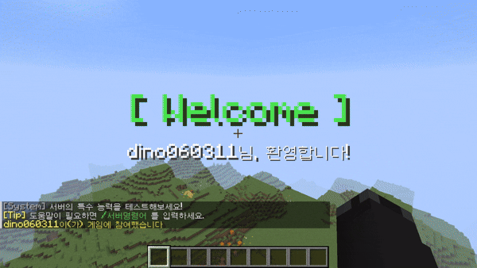

### 서버 입장 커스텀 타이틀 구현 (PlayerJoinEvent)

- 새로운 이벤트 핸들러 클래스 `JoinListener`를 설계하여 관심사 분리(Separation of Concerns)를 실천했습니다.
- 플레이어가 서버에 접속하는 순간(`PlayerJoinEvent`)을 감지하여 화면 중앙에 거대한 Welcome 타이틀과 서브타이틀(`sendTitle`)이 출력되도록 구현했습니다.
- **Tick 단위 제어:** 타이틀이 나타나는 시간(Fade-in), 머무는 시간(Stay), 사라지는 시간(Fade-out)을 틱(Tick) 단위로 정교하게 조정하여 사용자 경험(UX)을 향상시켰습니다.

> **[입장 환영 타이틀 검증]**
> 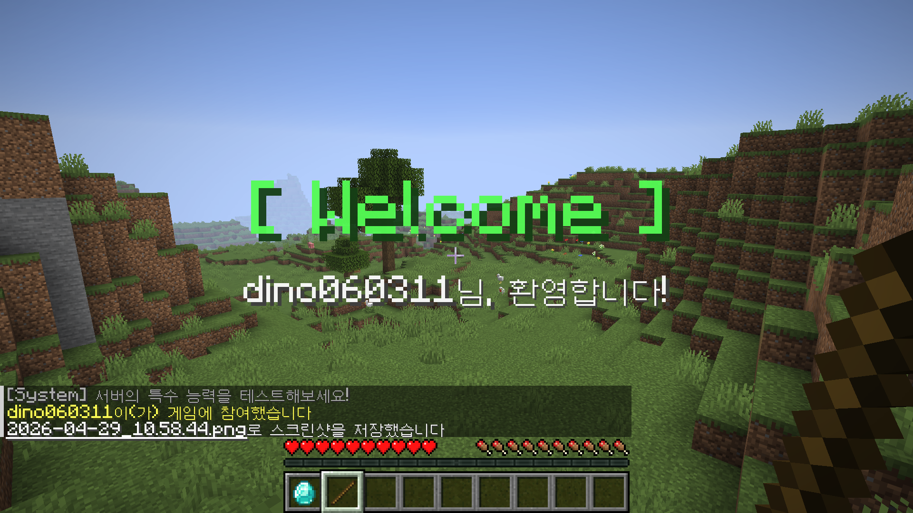

---

## 🎮 Skript MiniGame Systems

### Skript 기반 PvP 미니게임 시스템 구현 (가위바위보 데스매치)

- 기존 Java 플러그인 개발 방식에서 확장하여, **처음으로 Skript를 활용한 실시간 게임 로직 구현**을 진행했습니다.
- 단순 명령어 자동화를 넘어, **대전 신청 → 수락 → GUI 선택 → 승패 판정 → 전투 → 재시작/종료**까지 이어지는 상태 기반(State-driven) 미니게임 흐름을 설계했습니다.
- **대결 매칭 시스템:** `/가위바위보 <플레이어>` 명령어를 통해 특정 플레이어에게 결투를 신청하고, `/수락` 시 실시간 1:1 게임이 시작되도록 구현했습니다.
- **Custom GUI 선택 시스템:** 가상의 인벤토리 GUI를 활용하여 플레이어가 마우스 클릭만으로 `가위 / 바위 / 보`를 선택할 수 있도록 구성했으며, `InventoryClickEvent` 차단을 통해 아이템 탈취를 방지했습니다.
- **상태 저장 로직:** Skript 변수(`{rps.active::*}`, `{rps.choice::*}`)를 활용하여 플레이어 간 매칭 상태, 선택 결과, 역할(공격/방어)을 실시간으로 관리했습니다.
- **전투 연계 시스템:** 승자에게는 전용 검, 패자에게는 방패를 지급하여 단순 운 게임을 넘어 심리전 기반 PvP 요소를 추가했습니다.
- **예외 처리 및 UX 보완:** 미선택 자동 패배, 무승부 재경기, 자동 체력 회복 차단, 사망 시 게임 종료 등 실제 멀티플레이 환경에서 발생 가능한 예외 상황을 고려해 로직을 구성했습니다.

> **[가위바위보 데스매치 작동 검증]**
> 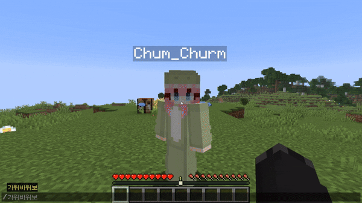

> **[최종 게임 결과창]**
>
> - **최종 승리**: 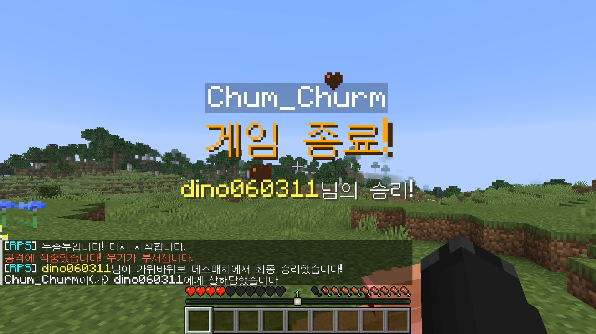
> - **최종 패배**: 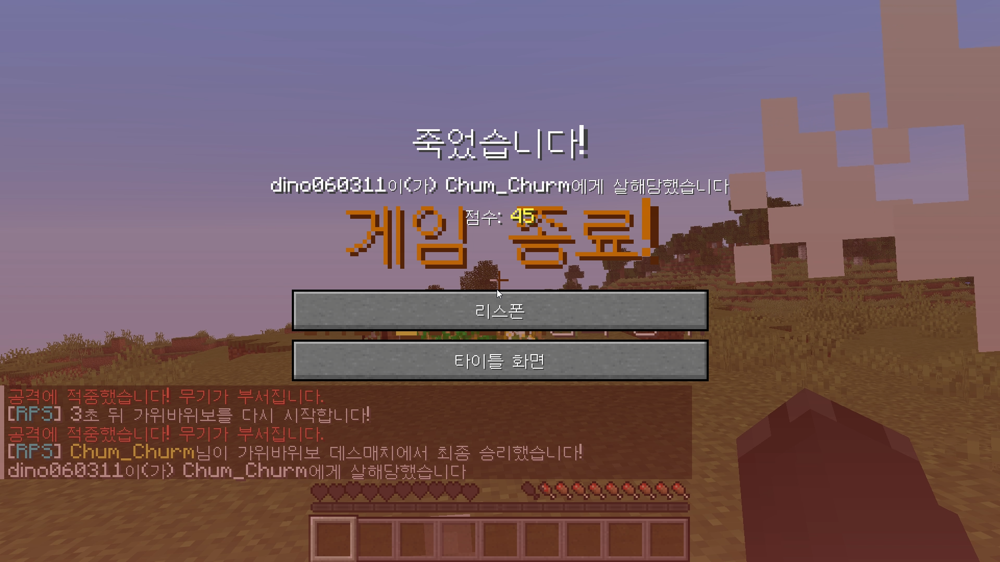

### 확률 기반 낚시 미니게임 시스템

- **타임어택 미니게임 구현:** /낚시게임 명령어 실행 시 60초 동안 제한 시간 내 최대한 많은 물고기를 낚아 점수를 획득하는 낚시 이벤트 콘텐츠를 구현했습니다.
- **확률 기반 보상 시스템:** 랜덤 확률 로직을 활용하여 대구(55%), 연어(25%), 복어(15%), 열대어(5%) 등 희귀도 기반 드롭 테이블과 차등 점수 시스템을 설계했습니다.
- **바닐라 이벤트 커스터마이징:** PlayerFishEvent를 활용해 기본 낚시 결과물을 감지하고, setItemStack()으로 공중에서 날아오는 생선 엔티티를 커스텀 아이템으로 실시간 교체하는 연출을 구현했습니다.
- **실시간 UI 및 세션 관리:** 액션바(ActionBar)를 통해 남은 시간 / 현재 점수를 실시간 표시하고, 플레이어별 UUID 기반 상태 관리를 적용해 다수 인원 환경에서도 독립적으로 동작하도록 설계했습니다.
- **예외 상황 대응 및 데이터 정리:** 게임 종료 및 중도 퇴장(QuitEvent) 시 이벤트용 낚싯대를 자동 회수하고 세션 데이터를 삭제하여 아이템 복제 및 데이터 꼬임 문제를 방지했습니다.

> **[낚시 게임 작동 검증]**
> 

### SkBee FastBoard 기반 실시간 GUI 순발력 미니게임 구현

- **GUI 미니게임 구현:** 4줄 체스트 GUI 내부에 무작위 위치로 목표 블록을 생성하고, 플레이어가 빠르게 클릭하여 점수를 획득하는 순발력 테스트 게임을 구현했습니다.
- **실시간 UI 연동:** SkBee fastboard를 활용해 현재 점수 / 남은 시간을 사이드바에 실시간 갱신하여 플레이 몰입도를 높였습니다.
- **인벤토리 백업 및 상태 복구:** 게임 시작 시 플레이어 인벤토리를 백업 후 검은 유리판으로 마스킹 처리하고, 종료 및 강제 종료(ESC) 시 원본 아이템을 안전하게 복구하는 로직을 구현했습니다.
- **안정적인 게임 상태 제어:** 플레이어별 변수와 metadata tag를 활용해 다중 사용자 환경에서도 게임 상태 충돌 없이 독립적으로 동작하도록 설계했습니다.

> **[순발력 미니게임 UI 및 예외 처리 검증]**
> 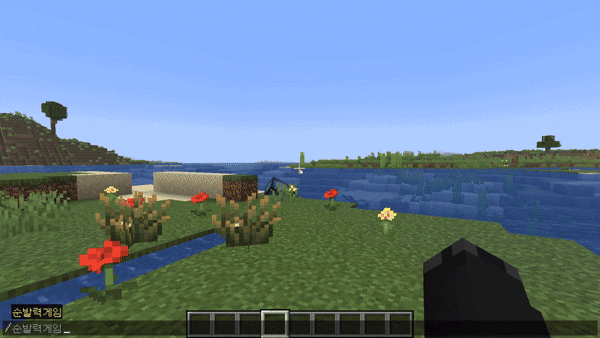

### 기절 및 소생 시스템

- **사망 방지 기반 기절 시스템:** 치명적인 피해를 받으면 즉시 사망하는 대신 **기절 상태(Down State)** 로 전환되도록 구현하여 팀 기반 협동 플레이 요소를 강화했습니다. 제한 시간 내 구조받지 못하면 최종 사망 처리됩니다.
- **상태 제어 및 행동 제한:** 기절한 플레이어에게 극단적인 `Slowness`, `Jump Boost`, `Blindness` 효과를 적용해 이동 및 시야를 제한하고, 추가 피해를 무효화하여 상태를 안정적으로 유지하도록 설계했습니다.
- **캐스팅 기반 소생 로직:** 기절한 플레이어 근처에서 **시프트(웅크리기)를 일정 시간 유지**해야 하는 캐스팅형 소생 시스템을 구현했습니다. 치료 도중 이동하거나 시프트를 해제하면 즉시 취소되도록 설계하여 상황극 긴장감을 높였습니다.
- **실시간 출혈 및 UX 연출:** 액션바(Action Bar)를 활용해 **남은 출혈 시간 및 치료 진행도**를 실시간으로 표시하여 플레이어가 현재 상태를 직관적으로 파악할 수 있도록 개선했습니다.
- **예외 상황 및 상태 복구 처리:** `forcekill` 플래그를 활용해 상태 충돌 문제를 방지했으며, 사망/리스폰 시 모든 디버프 및 상태 데이터를 초기화하여 데이터 꼬임을 예방했습니다.

> **[기절 시스템 작동 검증]**
> 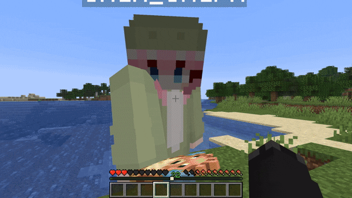

> **[소생 시스템 작동 검증]**
> 

---

## 🏗️ Architecture & Refactoring

### 중앙 제어 시스템 (InitManager)

- **개발 배경**: 기능이 늘어날수록 메인 코드가 복잡해지는 문제를 해결하고 싶었습니다.
- **초기화 로직의 캡슐화**: 명령어와 이벤트를 메인 클래스에 몰아넣지 않고, InitManager라는 전용 관리자를 만들어 한곳에서 등록하고 제어하도록 분리했습니다.
- **객체 생명주기 관리 및 의존성 관리**: 각 클래스가 필요로 하는 데이터(Manager, Service 등)를 `InitManager`를 통해 안전하게 주입하는 구조를 설계하여 객체 간 의존성을 체계적으로 관리할 수 있도록 개선했습니다.
- **역할 기반의 계층형 구조 도입**:
  - 기존의 기능 중심 폴더 구조에서 **명령어(`command`)**, **이벤트 리스너(`listener`)**, **핵심 로직(`service`)**, **데이터 관리(`manager`)**이라는 역할 단위 패키지로 재구성했습니다.
  - 이를 통해 새로운 기능을 추가할 때 어떤 파일이 어디에 위치해야 하는지 명확해졌으며, 코드의 가독성과 재사용성을 높였습니다.

### Maven 빌드 성공 (Build Automation)

Java 21 환경에서 Maven을 사용하여 소스 코드를 실행 가능한 `.jar` 파일로 변환하는 빌드 프로세스를 수립했습니다. 터미널을 통해 프로젝트의 무결성을 검증하고 빌드 성공을 확인했습니다.

> **[빌드 결과 인증]**
> 

### 서버 내 플러그인 활성화 확인 (Plugin Load)

PaperMC 서버의 `plugins` 폴더에 배포 후, 서버 콘솔에서 `/pl` 명령어를 입력하여 플러그인이 정상적으로 로드(초록색 활성화)된 것을 최종 확인했습니다.

> **[플러그인 활성화 인증]**
> 

### 해결했던 문제 (Troubleshooting)

- **파일 시스템 잠금 이슈 해결:** 서버 구동 중 파일 덮어쓰기 제한 문제를 서버 프로세스 제어(`stop` 커맨드)를 통해 해결하며 배포 안정성을 확보했습니다.
